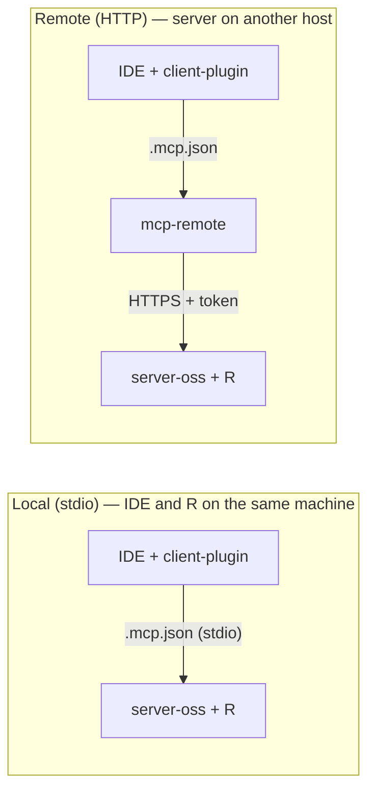

# openair-ai-kit

Air quality researchers and practitioners already have the data — sensor exports, monitoring station downloads, AURN archives, government portals. The friction is turning that data into a publication-grade openair chart without leaving your AI workflow. This kit removes that step: raw CSV, Excel, or public network data in, deterministic openair output out, via any MCP-capable client you already use — IDEs, Claude Desktop, ChatGPT, or agents you build — alongside your usual R scripts and notebooks.

Built on **[openair](https://github.com/openair-project/openair)** (MIT) — a server (Python + R) and an IDE plugin (skills, agent, MCP config). **Not affiliated** with [openair-project](https://github.com/openair-project) maintainers.

This repository is the **landing page** for the binomio. Code lives in the two repos below.

## Why this exists

AI workflows — IDEs, desktop assistants, autonomous agents — are now a standard layer in research, reporting, and product work. The bottleneck is not intelligence; it is getting clean, structured, analysis-ready data in front of that intelligence without manual reshaping.

This kit solves the data side for air quality. It ingests heterogeneous sources (IoT real-time exports, sensor platforms, government portals, public monitoring networks, other MCPs), normalises them onto a deterministic time grid, and hands openair a clean data frame — producing the same chart you would get from a script, with the same inputs, every time. No date parsing in the chat model, no LLM-invented arrays, no guesswork.

This is one layer. Pair it with a domain knowledge base, regulatory tools, memory, and a proper agent harness and you have a system that can reason over environmental data — not just visualise it.

## Repositories

| Repository | Role |
|------------|------|
| [**openair-3-mcp-server-oss**](https://github.com/miguel-escribano/openair-3-mcp-server-oss) | MCP server — Python + R + openair |
| [**openair-3-mcp-client-plugin-oss**](https://github.com/miguel-escribano/openair-3-mcp-client-plugin-oss) | IDE client plugin — router skill, specialist skills, agent, MCP config |

Current versions live on each repo's **GitHub release tags** — see the [server releases](https://github.com/miguel-escribano/openair-3-mcp-server-oss/releases) and [plugin releases](https://github.com/miguel-escribano/openair-3-mcp-client-plugin-oss/releases).

## Architectures



**Local stdio:** IDE spawns the Python server directly — no Node, no HTTP port. **Remote HTTP:** IDE uses `mcp-remote` to reach a server elsewhere. R only needs to run on the server host, not on the client.

## Quick start

1. **Run the server** where R lives — [local or remote](https://github.com/miguel-escribano/openair-3-mcp-server-oss#choose-your-setup) ([server README](https://github.com/miguel-escribano/openair-3-mcp-server-oss#quick-start)). On a cloud VM, push to `main` triggers deploy if you use a webhook deployer; the plugin itself stays on your IDE machine.
2. **Install the client plugin** and wire MCP — [client README](https://github.com/miguel-escribano/openair-3-mcp-client-plugin-oss#choose-your-setup). Use `.mcp.json` (Claude/Cursor/Codex) or `.vscode/mcp.json` (VS Code) — local stdio, localhost HTTP, or remote HTTPS via `mcp-remote`.
3. Ask in chat for a chart (CSV, AURN, EU import, etc.). The plugin routes ingest paths automatically; use `@skill-name` if routing fails — see [Using skills](https://github.com/miguel-escribano/openair-3-mcp-client-plugin-oss#using-skills) on the client repo.

## Verify it works

| Setup | How |
|-------|-----|
| **Any deployed server** | Plugin [test harness](https://github.com/miguel-escribano/openair-3-mcp-client-plugin-oss/blob/main/tests/README.md) — `run_series_exercises.py` + `run_wind_exercises.py` (12/12 + 4/4) |
| **VS Code + remote MCP** | [vscode-chat-felisa.md](https://github.com/miguel-escribano/openair-3-mcp-client-plugin-oss/blob/main/examples/vscode-chat-felisa.md) — uses committed `tests/fixtures/felisa_munarriz.json` |
| **Plot picker** | [plot-catalog.md](https://github.com/miguel-escribano/openair-3-mcp-client-plugin-oss/blob/main/examples/plot-catalog.md) |
| **Server dev only** | `pytest` + `check_integrations.py` in server repo — pre-deploy, not a substitute for the harness |

**Do not** use example paths like `data/felisa.xlsx` in chat unless that file exists on the **MCP server host**.

## Example prompts

### Layer 1 — standalone (openair kit + any LLM)

The LLM orchestrates the pipeline; interpretation of results is yours. The agent follows guardrails in the client plugin (`openair-agent.md`, O1–O6): no date parsing in chat, no invented data, no hunting for files that are not on disk, one plot per prepare call, wind source stated for polar/wind plots.

**VS Code + remote MCP (smoke — no Excel file needed)**
```
Use tests/fixtures/felisa_munarriz.json in the plugin repo.
Prepare hourly Europe/Madrid, then time_plot all pollutants. MCP tools only.
Do not search for data/felisa.xlsx or other server paths.
```
See [vscode-chat-felisa.md](https://github.com/miguel-escribano/openair-3-mcp-client-plugin-oss/blob/main/examples/vscode-chat-felisa.md).

**Excel on your PC + remote MCP**
```
I have the Navarra hourly Excel at [full path on my PC].
Datetime Fecha/hora, timezone Europe/Madrid, dedupe duplicate hours.
Run export_local_series.py, then prepare hourly and time_plot via MCP.
```

**CSV or Excel on the MCP server host** (local stdio, or file you uploaded to the server)
```
Load [/absolute/path/on/server/data.csv], datetime column "[date_col]", pollutants [PM10, NO2],
timezone [Europe/Madrid]. Prepare hourly and show a time_plot.
```
Only when the file **exists on the server filesystem** — not in the IDE workspace.

**Public network import**
```
Import AURN data for site [MY1], pollutant [no2], from [2024-01-01] to [2024-03-31].
Prepare hourly and show summary_plot, then calendar_plot.
```

**Wind / polar plot (file includes ws and wd columns)**
```
Load [/path/to/data.csv], datetime "[date_col]", columns [ws, wd, PM10],
timezone [UTC], lat [42.806], lon [-1.644]. Show a polar_plot for PM10.
```

**Multi-pollutant correlation**
```
Load [/path/to/data.csv], columns [PM10, NO2, O3, CO2]. Prepare hourly UTC.
Show a cor_plot.
```

**Diurnal pattern**
```
Import [AURN / EU] data for site [SITE_CODE], pollutant [no2],
from [START_DATE] to [END_DATE]. Prepare hourly, timezone [Europe/London].
Show a time_variation.
```

---

### Layer 2 — multi-MCP reporting *(openair kit as the chart layer)*

These prompts assume **other MCP servers** in the same client — e.g. a sensor export API, a weather feed, or your own reporting stack. This kit supplies **ingest, prepare, and openair plots**; anything beyond charts (compliance scoring, recommendations, HTML briefs) comes from tools **you** wire in. No product names required — replace placeholders with your own sources and frameworks.

**Indoor + outdoor source apportionment**
```
For sensor [SENSOR_ID] at lat [LAT], lon [LON], export hourly PM2.5 and NO2
for [START_DATE] to [END_DATE] via your sensor MCP.
Fetch outdoor PM2.5 from the nearest [AURN / EU] monitoring station [SITE_CODE]
for the same period (openair kit).
Plot both indoor and outdoor PM2.5 on a time_plot, then plot a polar_plot
of outdoor NO2 vs wind to identify dominant source directions.
Interpret: which indoor PM2.5 events coincide with high-wind outdoor episodes
vs local indoor sources?
```

**Ventilation window recommendation with wind context**
```
For sensor [SENSOR_ID], export last [7] days of hourly CO2 and PM2.5 (sensor MCP).
Fetch outdoor wind speed and direction for lat [LAT], lon [LON] (weather MCP or CSV with ws/wd).
Plot a polar_plot of outdoor PM2.5 vs wind direction (openair kit).
Identify wind directions and hours where outdoor PM2.5 is lowest.
Cross with indoor CO2 peaks (ventilation demand).
Recommend optimal window-opening windows that maximise CO2 flush
while minimising PM2.5 infiltration.
```

**Multi-site ambient + indoor trend brief**
```
Produce a [weekly / monthly] air quality brief for [SITE_NAME].
Indoor sensors: [SENSOR_IDS]. Nearest ambient station: [SITE_CODE] ([AURN / EU]).
Period: [START_DATE] to [END_DATE].
Include: status against [your regulatory framework], a time_variation
for indoor [CO2, PM2.5] (openair kit), a wind_rose for the ambient station,
and a cor_plot across indoor and outdoor pollutants.
Flag parameters driven by outdoor events vs internal sources.
Output as HTML via your reporting workflow.
```

**Episode investigation (wildfire / pollution event)**
```
On [EVENT_DATE], indoor PM2.5 spiked at sensor [SENSOR_ID].
Export hourly indoor PM2.5, PM10 for [EVENT_DATE ± 2 days] (sensor MCP).
Import outdoor data from [AURN / EU] station [SITE_CODE] for the same window (openair kit).
Plot indoor vs outdoor PM2.5 on a time_plot.
Plot a polar_plot and a pollution_rose from the outdoor station to identify
source direction and speed profile during the event.
Summarise the likely infiltration pathway and impact against [your framework].
```

**Seasonal pattern and long-term trend**
```
For sensor [SENSOR_ID] and ambient station [SITE_CODE], export [POLLUTANT]
for the full period [START_DATE] to [END_DATE] (min 3 months).
Plot a calendar_plot for indoor [POLLUTANT] (openair kit) to reveal seasonal structure.
Plot a theil_sen trend for the outdoor ambient series.
Interpret indoor vs outdoor trends: tracking ambient conditions or building-driven?
Assess using [your regulatory framework].
```

---

## Scope

Charts and data access through MCP, powered by openair on R. No interpretation, compliance advice, or health guidance — those belong in your own reporting workflow. For methodology, see the [openair book](https://openair-project.github.io/book/).

## Credits

Charts are produced by **[openair](https://github.com/openair-project/openair)** (MIT) — David Carslaw, Karl Ropkins, and the openair-project community. Cite Carslaw & Ropkins (2012) when you publish figures. This MCP binomio is an open-source bridge to MCP clients; it is **not affiliated with or endorsed by** openair-project maintainers. Runtime third-party notices: [server NOTICE.md](https://github.com/miguel-escribano/openair-3-mcp-server-oss/blob/main/NOTICE.md). Public network data carries separate provider licences (e.g. UK [OGL](https://www.nationalarchives.gov.uk/doc/open-government-licence/version/3/)).

## Learn openair

- [openair-project on GitHub](https://github.com/openair-project)
- [openair reference](https://openair-project.github.io/openair/)
- [openair book](https://openair-project.github.io/book/)
